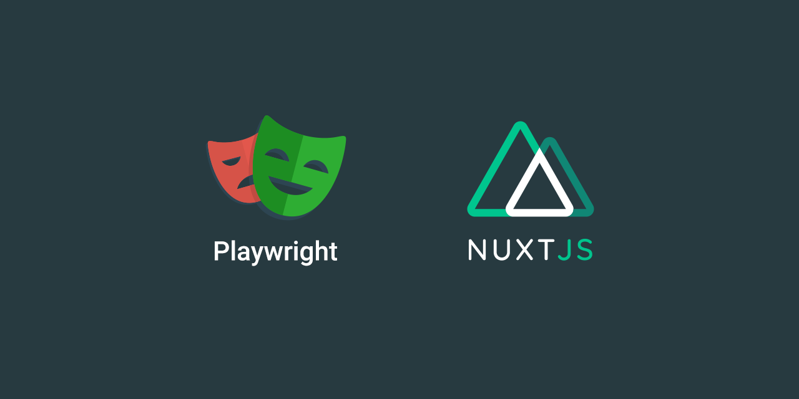

Run simple browser tests with [playwright](https://playwright.dev/) and [jest](https://jestjs.io/) for nuxt. 

## 🖍️ Why

This repository exists to write playwright browser tests for your nuxt application. It's using [nuxt/test-utils](https://github.com/nuxt/test-utils) under the hood with some modifications to it. 

### Why not using `@nuxt/test-utils`?

For my use case I run my nuxt application in a docker container (See: [nuxt-docker Starter](https://github.com/regenrek/nuxt-docker)) and run these tests against it. So I don't need to configure the nuxt build process (Nuxt builder) and avoid problems with dependencies (like esmodule, transpile errors, postcss problems e.g.) on startup. 

While writing tests its also easier for me that my nuxt application is always up (in a docker container) and I can run my tests against it. 

The last part is the `rootDir/testDir` configuration nuxt/test-utils project which just didn't work out of the box with my application.

## 📌 Prerequisites

* As I explained above you need to run nuxt manually.
* Only ssr supported

## What this repository is not intended for

* Auto startup nuxt on running tests -> `nuxt builder`
* Testing static builds -> `nuxt-generate` (will maybe support later)
* Nuxt modules testing

You should consider using [nuxt/test-utils](https://github.com/nuxt/test-utils)

## 🚀 Features

* Nuxt.js
* Nginx (Access site via `localhost:8080`)

## 📦 Install

```
git@github.com:regenrek/nuxt-playwright-template.git my-webapp-tests
cd my-webapp-tests
```

```
yarn
```

## 📦 Usage

### Run your tests
This will run tests in the `test` directory

```
yarn test
```

More verbose output
```
yarn test:debug
```

## Cookie support

Sometimes you want to set cookies when starting the application. For example to disable a cookie-law banner e.g.
So you can fill the `test/testdata/cookiesDummy.json` with your custom cookies.

You can disable cookie support with

```
    const page = await createPage('/', { disableDefaultCookies: true })
```

## License

[MIT License](./LICENSE)